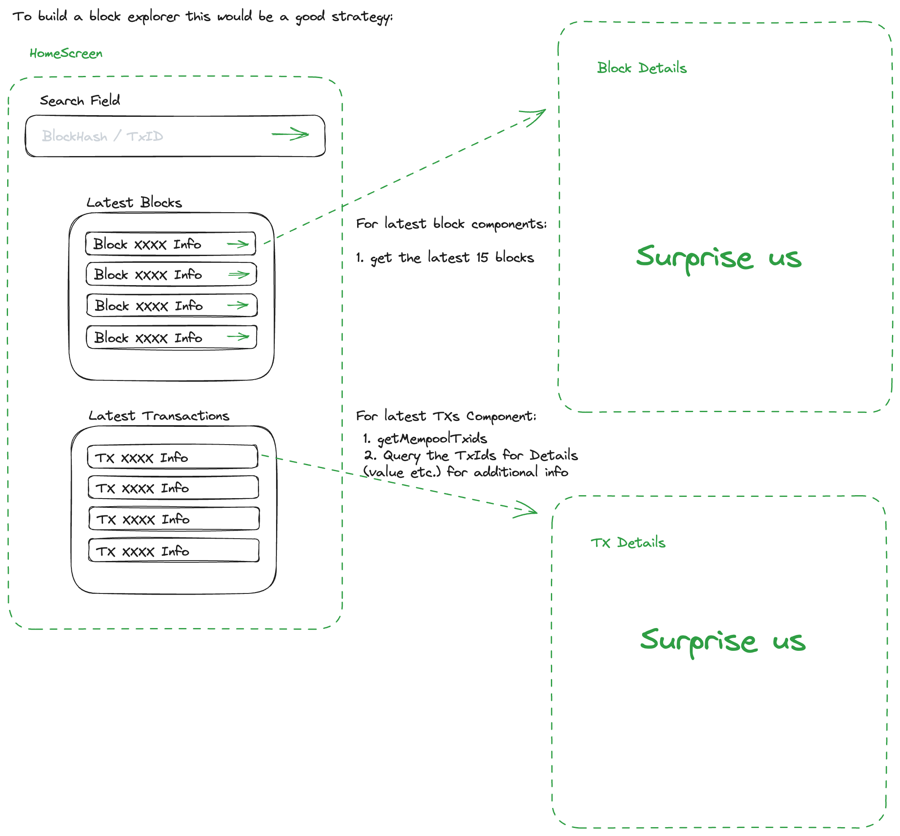

<p align="center">
  <a href="http://bitwala.com/" target="blank"></a>
</p>

# Coding Challenge Introduction

Welcome to our coding challenge! We have built an exciting task for you that will require you to flex your React Native muscles and tap into the power of blockchain technology.

For this task, you will be provided with a robust backend setup based on the Nest framework Typescript starter repository. The backend service will be up and running with a simple `docker-compose up` command, freeing you from the hassle of backend setup.

Your main task is to code a frontend in React Native that interfaces with this backend. Your application should utilize the available GraphQL queries to perform different actions. We recommend you use this opportunity to create a basic blockchain explorer (see https://blockstream.info/) that allows users to explore the latest blocks and transactions. 


  

This challenge is designed to evaluate your skills in building intuitive UIs, implementing navigation, and leveraging APIs in React Native. 

Here are three other ideas for tasks:

1. **Transaction Inspector**: Create an interface where users can input a transaction hash. Use the `getTransaction`, `getTransactionStatus`, `getTransactionHex`, and `getTransactionMerkleProof` endpoints to fetch and display comprehensive transaction details.

2. **Address Analyzer**: Develop a feature that allows users to input a Bitcoin address and use the `getAddressInfo`, `getAddressTransactions`, and `getAddressUtxos` endpoints to provide an in-depth analysis of the address, including its transactions, unspent outputs, and more.

3. **Mempool Monitor**: Implement a screen that uses the `getMempoolInfo` and `getMempoolTxids` endpoints to provide a real-time overview of the current mempool status, including the number of transactions waiting to be confirmed, transaction IDs, and more.

Remember, the focus here is not just on functionality but also on usability and design. So pay attention to the UI/UX aspects of your solution. Good luck, and we look forward to seeing your solution!

_Note: Make sure to carefully check the documentation for each GraphQL query to understand the input parameters and return types._

-----
## Description

This coding challenge is based on the [Nest](https://github.com/nestjs/nest) framework TypeScript starter repository.

To get started run `docker-compose up -d`

Server should start up and a GraphQL Playground should be available under `localhost:3000/graphql` 

On the right hand site you can find **_Docs_** about available queries as well as the **_Schema_**, which you can download or copy to use in your frontend.

## Installation

```bash
$ yarn install
```

## Running the app
### Docker (recommended)
`docker-compose up`

### Local
```bash
# development
$ yarn run start

# watch mode
$ yarn run start:dev

# production mode
$ yarn run start:prod
```

## Test

```bash
# unit tests
$ yarn run test

# e2e tests
$ yarn run test:e2e

# test coverage
$ yarn run test:cov
```


# GraphQL

## Example Queries

The example Queries list all data that can be retrieved from the Queries, omit those you do not need.


```GraphQL
{
  getBlockTransactions(hash: "00000000000000000000c46287836d6018f1e6b2c02e33bd60e5c0681bcfe211",index: 50){
  txid
  fee
  vout {
    value
  }
  status {
    block_hash
  }
}}
```

```GraphQL
{
  getTransaction(txid:"27ed44d37b0e0a30d8c85c85a8cf6e7bf632207130a4447932ce057646f2e1de"){
	txid
  version
  locktime
  size
  weight
  fee
  vin {
    txid
    vout
  }
  vout {
    value
  }
  status {
    confirmed
    block_height
    block_hash
    block_time
  }
}}
```

```GraphQL
{
  getAddressInfo(address: "bc1q9p0h7xsvh7c0nscz4lxgr6jf0umnf4uzu530h8") {
    address
    chain_stats {
    	funded_txo_count
      funded_txo_sum
      spent_txo_count
      spent_txo_sum
      tx_count
    }
    mempool_stats {
      funded_txo_count
      funded_txo_sum
      spent_txo_count
      spent_txo_sum
      tx_count
    }
  }
}
```


```GraphQL
{
  getTransactionMerkleProof(
    txid: "05f3f2ed502e5c046572f4a6f2064b4d7b55463b21cb688c65e117ae3cde567c"
  ) {
    block_height
    merkle
    pos
  }
}
```

```GraphQL
{
  getTransactionOutspends(
    txid: "05f3f2ed502e5c046572f4a6f2064b4d7b55463b21cb688c65e117ae3cde567c"
  ) {
    spent
    txid
    vin
    status {
      confirmed
    }
  }
}
```

```GraphQL
{
  getTransactionOutspend(
    txid: "05f3f2ed502e5c046572f4a6f2064b4d7b55463b21cb688c65e117ae3cde567c", vout: 0
  ) {
    spent
    txid
    vin
    status {
      confirmed
    }
  }
}
```

```GraphQL
{
  getTransactionHex(
    txid: "05f3f2ed502e5c046572f4a6f2064b4d7b55463b21cb688c65e117ae3cde567c"
  )
}
```

```GraphQL
{
  getMempoolTxids
}
```

```GraphQL
{
  getBlockHashAtHeight(height: 100000)
}
```
### get 10 latest blocks

```GraphQL
{
  getTenLatestBlocks{
    id
    height
    tx_count
  }
}
```

### get 10 latest blocks from startHeight 100.000
```GraphQL
{
  getTenLatestBlocks(startingHeight: 100000){
    id
    height
    tx_count
  }
}
```